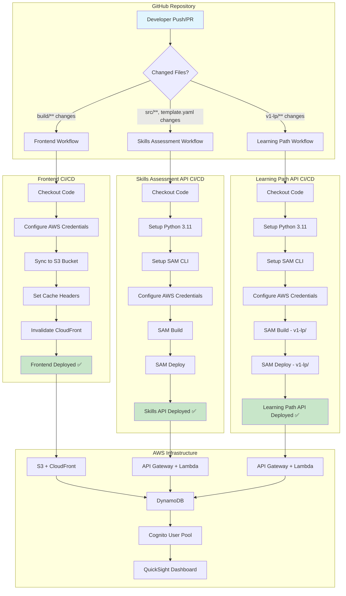
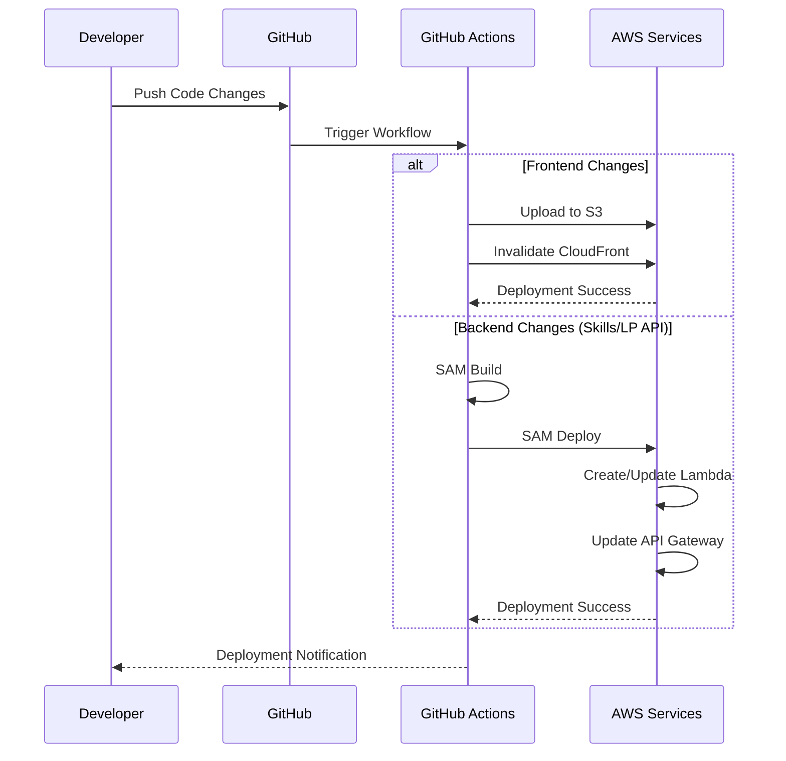

# CI/CD Architecture - Skill Management Portal

## Overview
This document provides a graphical representation of the CI/CD pipeline for the Skill Management Portal, covering Frontend, Skills Assessment API, and Learning Path API deployments.

## CI/CD Flow Diagram



## Workflow Triggers

### Frontend Deployment
- **Trigger**: Changes to `build/**` directory
- **Workflow**: `.github/workflows/deploy-frontend.yml`
- **Target**: S3 + CloudFront

### Skills Assessment API
- **Trigger**: Changes to `src/**`, `template.yaml`, `samconfig.toml`
- **Workflow**: `.github/workflows/deploy-skills-assessment.yml`
- **Target**: Lambda + API Gateway

### Learning Path API
- **Trigger**: Changes to `v1-lp/**`
- **Workflow**: `.github/workflows/deploy.yml`
- **Target**: Lambda + API Gateway

## Deployment Flow Details



## Environment Configuration

### Required GitHub Secrets
```
AWS_ACCESS_KEY_ID
AWS_SECRET_ACCESS_KEY
```

### AWS Resources
- **S3 Bucket**: Frontend hosting
- **CloudFront**: CDN distribution
- **API Gateway**: REST API endpoints
- **Lambda Functions**: Backend logic
- **DynamoDB**: Data storage
- **Cognito**: Authentication
- **QuickSight**: Analytics dashboard

## Manual Deployment Options

All workflows support manual triggering via `workflow_dispatch` for on-demand deployments.

```bash
# Trigger via GitHub CLI
gh workflow run deploy-frontend.yml
gh workflow run deploy-skills-assessment.yml
gh workflow run deploy.yml
```